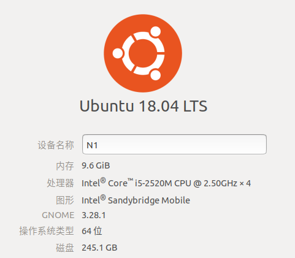

Zipline是QUANTOPIAN开发的算法交易库。这是一个事件驱动，支持回测和实时交易的系统。
Zipline目前有一个免费的[回测平台](https://www.quantopian.com)，可以很方便编写交易策略和执行回测。为处理A股数据，增加或修改基础数据相关部分，用于本机策略回测分析。

#### 功能

##### 新增`USEquityPricing`数据列

+ `prev_close` 前收盘
+ `turnover` 换手率
+ `amount` 成交额
+ `tmv` 总市值
+ `cmv` 流通市值
+ `circulating_share` 流通股本
+ `total_share` 总股本

**注意** 以上数据不会因股票分红派息而调整

##### 新增`Fundamentals`数据容器

`Fundamentals`是用于`pipeline`的数据集容器，包括偶发性变化及固定信息数据，如上市日期、行业分类、所属概念、财务数据等信息。

##### 投资组合优化
参考quantopian公司帮助文档，完成`optimize`模块，实现在限定条件下的`MaximizeAlpha`及`TargetWeights`投资组合优化。

##### 技术分析图
`AnalysisFigure`绘制OHLCV及常用`MACD`等技术指标图，使用买入卖出信号标注来辅助策略改进。
<div>

</div>

##### 提供后台自动提取、转换数据脚本

通过定时后台计划任务，自动提取回测所需网络数据，并转换为符合`zipline`需求的数据格式，可以更加专注于编写策略及相关分析。

#### 安装

##### 克隆


```bash
$ git clone https://github.com/zhangshoug/czipline.git
```
##### 建立环境
```bash
$ conda create -n zipline python=3.6 # 环境名称随意，python版本要求3.6
```

##### 安装依赖包
以下安装需要进入环境
```bash
$ source activate zipline # 进入刚才建立的环境 
$ activate zipline        # windows 进入环境
```

下载并安装ta-lib包以及数据处理包、统计分析包。转移至项目安装文件所在目录后执行：

参考`talib`[安装方法](https://github.com/mrjbq7/ta-lib)

```bash
$ # 以下需确保在zipline项目安装目录下执行
$ pip install -r ./etc/requirements.txt
$ pip install -r ./etc/requirements_add.txt
```


##### 编译`C`扩展库


```bash
$ python setup.py build_ext --inplace
```

##### 安装`zipline`


```bash
$ python setup.py install
$ # 如需开发安装
$ python setup.py develop
```

#### 准备数据
成功安装`zipline`后，`cswd`包也已经成功安装。在相应环境下，执行以下命令：


```bash
$ init-stock-data # 初始化基础数据。耗时大约24小时(主要下载日线及最近一个月的分时交易数据。对数据量小，但抓取网页数据耗时长的，整理好的数据存放在github，初始化时会从该处提取，节约初始化时间。)

$ zipline ingest # 转换日线数据，耗时约10分钟

$ sql-to-bcolz # `Fundamentals`数据，耗时约1.5分钟

# 如需要进行回测分析，请运行以下指令，生成ff因子数据(empyrical包使用)
$ gen-ff-factors
```
初始化数据后，参考[如何设置后台数据自动处理](./docs/介绍材料/bg_tasks.cron)，设置后台计划任务。后台在盘后自动完成数据导入及转换。网络数据的采集可能因各种原失败，请注意查阅日志文档。文档默认路径为"～/stockdata/logs"。

#### 验证安装
如能正常运行以下代码，证明已经安装成功。(注意，由于版本兼容问题，安装过程中会有大量警告信息，只要不是错误，可忽略)

```python
from zipline import get_calendar
c = get_calendar('SZSH')
c.first_session
# Timestamp('1990-12-19 00:00:00+0000', tz='UTC', freq='C')
```

#### 使用

计算`Fama-French`三因子案例涉及到：
1. 如何在`Notebook`运行回测
2. 选择基准收益率指数代码
3. 计划函数用法
4. `Fundamentals`及财务数据
5. `pipeline`及自定义因子用法
6. 回测速度

比较适合作为演示材料


```python
%load_ext zipline
```


```python
%%zipline --start 2017-1-1 --end 2018-1-1 --bm-symbol 399001
from zipline.api import symbol, sid, get_datetime

import pandas as pd
import numpy as np
from zipline.api import (attach_pipeline, pipeline_output, get_datetime,
                         calendars, schedule_function, date_rules)
from zipline.pipeline import Pipeline
from zipline.pipeline import CustomFactor
from zipline.pipeline.data import USEquityPricing
from zipline.pipeline.fundamentals import Fundamentals

# time frame on which we want to compute Fama-French
normal_days = 31
# approximate the number of trading days in that period
# this is the number of trading days we'll look back on,
# on every trading day.
business_days = int(0.69 * normal_days)


# 以下自定义因子选取期初数
class Returns(CustomFactor):
    """
    每个交易日每个股票窗口长度"business_days"期间收益率
    """
    window_length = business_days
    inputs = [USEquityPricing.close]

    def compute(self, today, assets, out, price):
        out[:] = (price[-1] - price[0]) / price[0] * 100


class MarketEquity(CustomFactor):
    """
    每个交易日每只股票所对应的总市值
    """
    window_length = business_days
    inputs = [USEquityPricing.tmv]

    def compute(self, today, assets, out, mcap):
        out[:] = mcap[0]


class BookEquity(CustomFactor):
    """
    每个交易日每只股票所对应的账面价值（所有者权益）
    """
    window_length = business_days
    inputs = [Fundamentals.balance_sheet.A107]

    def compute(self, today, assets, out, book):
        out[:] = book[0]


def initialize(context):
    """
    use our factors to add our pipes and screens.
    """
    pipe = Pipeline()
    mkt_cap = MarketEquity()
    pipe.add(mkt_cap, 'market_cap')

    book_equity = BookEquity()
    # book equity over market equity
    be_me = book_equity / mkt_cap
    pipe.add(be_me, 'be_me')

    returns = Returns()
    pipe.add(returns, 'returns')

    attach_pipeline(pipe, 'ff_example')
    schedule_function(
        func=myfunc,
        date_rule=date_rules.month_end())


def before_trading_start(context, data):
    """
    every trading day, we use our pipes to construct the Fama-French
    portfolios, and then calculate the Fama-French factors appropriately.
    """

    factors = pipeline_output('ff_example')

    # get the data we're going to use
    returns = factors['returns']
    mkt_cap = factors.sort_values(['market_cap'], ascending=True)
    be_me = factors.sort_values(['be_me'], ascending=True)

    # to compose the six portfolios, split our universe into portions
    half = int(len(mkt_cap) * 0.5)
    small_caps = mkt_cap[:half]
    big_caps = mkt_cap[half:]

    thirty = int(len(be_me) * 0.3)
    seventy = int(len(be_me) * 0.7)
    growth = be_me[:thirty]
    neutral = be_me[thirty:seventy]
    value = be_me[seventy:]

    # now use the portions to construct the portfolios.
    # note: these portfolios are just lists (indices) of equities
    small_value = small_caps.index.intersection(value.index)
    small_neutral = small_caps.index.intersection(neutral.index)
    small_growth = small_caps.index.intersection(growth.index)

    big_value = big_caps.index.intersection(value.index)
    big_neutral = big_caps.index.intersection(neutral.index)
    big_growth = big_caps.index.intersection(growth.index)

    # take the mean to get the portfolio return, assuming uniform
    # allocation to its constituent equities.
    sv = returns[small_value].mean()
    sn = returns[small_neutral].mean()
    sg = returns[small_growth].mean()

    bv = returns[big_value].mean()
    bn = returns[big_neutral].mean()
    bg = returns[big_growth].mean()

    # computing SMB
    context.smb = (sv + sn + sg) / 3 - (bv + bn + bg) / 3

    # computing HML
    context.hml = (sv + bv) / 2 - (sg + bg) / 2


def myfunc(context, data):
    d = get_datetime('Asia/Shanghai')
    print(d, context.smb, context.hml)
```

    2017-01-26 15:00:00+08:00 0.014014289806335789 6.605843892342312
    2017-02-28 15:00:00+08:00 4.1169182374497195 7.690119769984805
    2017-03-31 15:00:00+08:00 0.35808304923773615 2.7492806758694215
    2017-04-28 15:00:00+08:00 -4.318408584890385 5.414312699826368
    2017-05-31 15:00:00+08:00 -0.4828317045367072 3.0869028143557147
    2017-06-30 15:00:00+08:00 0.8640245866550513 0.09803178533289003
    2017-07-31 15:00:00+08:00 -2.3024594948720227 6.2829537294457145
    2017-08-31 15:00:00+08:00 3.2003154621799155 2.269609384481118
    2017-09-29 15:00:00+08:00 1.1669055941862554 -0.6079568594636064
    2017-10-31 15:00:00+08:00 -1.6233534895267374 -0.795885505339075
    2017-11-30 15:00:00+08:00 -2.965097825507776 4.4434701009908615
    2017-12-29 15:00:00+08:00 -1.1942883365086068 -0.38062423581176485
    [2018-05-02 02:07:02.681398] INFO: zipline.finance.metrics.tracker: Simulated 244 trading days
    first open: 2017-01-03 01:31:00+00:00
    last close: 2017-12-29 07:00:00+00:00

**运行时长10-12秒**

+ 有关如何使用，请参考[quantopian使用手册](https://www.quantopian.com/help)。
+ 有关本项目的说明，请参阅[介绍材料](./docs/介绍材料)
+ 有关后台自动数据处理，请参考[脚本](./docs/介绍材料/bg_tasks.cron)

**特别说明**：个人当前使用Ubuntu18.04操作系统

#### 参考配置



+ Ubuntu 18.04
+ Anaconda 
+ python 3.6

#### 交流

该项目纯属个人爱好，水平有限，欢迎加入来一起完善。

**添加个人微信(ldf10728268)，请务必备注`zipline`**
<div>

</div>
